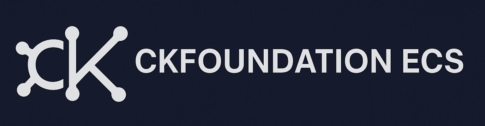

<!-- Banner -->

  

# CkFoundation ECS
Entity Component System framework for Unreal Engine

This project is licensed under the CkFoundation License - see the [LICENSE.md](LICENSE.md) file for details.

> ⚠️ Note: The `CkThirdParty` module contains third-party libraries which carry their own licenses (e.g., MIT). The CkFoundation License does **not** override these licenses.
