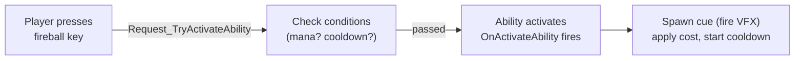

# CkAbility

Ability system that lets entities own, grant, activate, and revoke gameplay abilities. Abilities are data-driven via script assets (`UCk_Ability_Script_PDA`) and support sub-abilities for conditions, costs, and cooldowns.

## Key Concepts

- **AbilityOwner** — An entity that holds a collection of abilities. Manages granting, revoking, and activating them.
- **Ability** — An ECS entity representing one ability instance. Defined by a script asset that implements lifecycle events (activate, deactivate, give, revoke).
- **Ability Script (`UCk_Ability_Script_PDA`)** — Blueprint-implementable data asset where you define what happens when the ability fires. Override `DoOnActivateAbility`, `DoOnDeactivateAbility`, etc.
- **Sub-Abilities** — Abilities can have child abilities that act as conditions (can I activate?), costs (deduct mana), cooldowns (lock after use), or parallel effects.
- **Ability Cue** — A spawnable visual/audio effect triggered during ability activation via `UCk_Utils_AbilityCue_UE`.
- **Activation Policy** — Controls behavior: manual activation, activate-on-grant, or allow reactivation while already active.

## Example: Character Activates a Fireball



## Usage Examples

### Give an ability to an entity

```cpp
FCk_Request_AbilityOwner_GiveAbility Request;
Request.Set_AbilityClass(UFireball_Ability_Script::StaticClass());
UCk_Utils_AbilityOwner_UE::Request_GiveAbility(AbilityOwner, Request, OnGivenDelegate);
```

### Try to activate an ability

```cpp
FCk_Request_AbilityOwner_ActivateAbility Request;
Request.Set_AbilityClass(UFireball_Ability_Script::StaticClass());
UCk_Utils_AbilityOwner_UE::Request_TryActivateAbility(AbilityOwner, Request, OnResultDelegate);
```

### React to ability activation

```cpp
UCk_Utils_Ability_UE::BindTo_OnAbilityActivated(AbilityHandle, OnActivatedDelegate);
```

### Spawn an ability cue

```cpp
auto Params = UCk_Utils_AbilityCue_UE::Make_AbilityCue_Params(Location, Direction, Source, Target);
UCk_Utils_AbilityCue_UE::Request_Spawn_AbilityCue(OwnerEntity, SpawnRequest);
```

## Tests

No tests found for this module in CkTest.
