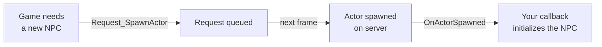

# CkActor

Deferred actor spawning and component manipulation through ECS requests. Wraps Unreal's actor/component creation into the request pattern with network-aware spawn policies and completion callbacks.

## Key Concepts

- **SpawnActor Request** — Deferred actor spawning with configurable policies: `SpawnOnInstanceWithOwnership`, `SpawnOnServer`, `SpawnOnAll`.
- **AddActorComponent / RemoveActorComponent** — Dynamic component attachment and removal at runtime, with optional parent socket, tick settings, and uniqueness constraints.
- **PostSpawnPolicy** — What happens after spawning: `None` or `AttachImmediately`.
- **Signals** — `OnActorSpawned`, `OnActorComponentAdded`, `OnActorComponentRemoved` fire after each operation completes.

## Example: Spawning an NPC at Runtime



## Usage Examples

### Spawn an actor

```cpp
FCk_Request_ActorModifier_SpawnActor Request;
Request.Set_ActorClass(AMyNPC::StaticClass());
Request.Set_SpawnTransform(SpawnLocation);
UCk_Utils_ActorModifier_UE::Request_SpawnActor(OwnerEntity, Request, Payload, OnSpawnedDelegate);
```

### Add a component to an actor

```cpp
FCk_Request_ActorModifier_AddActorComponent Request;
Request.Set_ComponentClass(UMyComponent::StaticClass());
UCk_Utils_ActorModifier_UE::Request_AddActorComponent(OwnerEntity, Request, Payload, OnAddedDelegate);
```

### Remove a component

```cpp
FCk_Request_ActorModifier_RemoveActorComponent Request;
Request.Set_Component(ComponentToRemove);
UCk_Utils_ActorModifier_UE::Request_RemoveActorComponent(OwnerEntity, Request, Payload, OnRemovedDelegate);
```

## Tests

No tests found for this module in CkTest.
