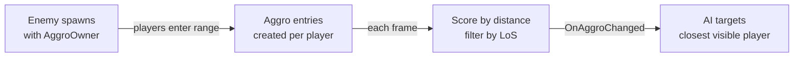

# CkAggro

Threat tracking system for AI. Entities with an AggroOwner maintain a list of threats, scored by distance and filtered by line-of-sight, with the "best" threat automatically updated each frame.

## Key Concepts

- **AggroOwner** — An entity that tracks multiple threats. Has configurable aggro range and optional distance/LoS filters.
- **Aggro** — A single entry in the threat list, pointing at a target entity. Has a score (lower = higher priority, based on distance).
- **Best Aggro** — The highest-priority visible threat. Automatically recalculated each frame. Fires `OnAggroChanged` when it switches.
- **Exclusion** — Threats can be temporarily excluded (e.g., target died) without removing them from the list.
- **Filters** — Distance filter (beyond range = excluded) and line-of-sight filter (can't see = excluded). Both optional.

## Example: Enemy AI Picks Closest Visible Player



## Usage Examples

### Set up an aggro owner

```cpp
FCk_Fragment_AggroOwner_Params Params;
Params.Set_AggroRange(5000.0f);
UCk_Utils_AggroOwner_UE::Add(EnemyEntity, Params);
```

### Add a threat

```cpp
UCk_Utils_Aggro_UE::Add(AggroOwner, PlayerEntity, AggroParams);
```

### Get the current best threat

```cpp
auto BestAggro = UCk_Utils_AggroOwner_UE::Get_BestAggro(AggroOwner);
auto TargetEntity = UCk_Utils_Aggro_UE::Get_AggroTarget(BestAggro);
```

### React when the best threat changes

```cpp
UCk_Utils_AggroOwner_UE::BindTo_OnAggroChanged(AggroOwner, OnChangedDelegate);
```

### Exclude/include a threat

```cpp
UCk_Utils_Aggro_UE::Request_Exclude(AggroHandle);  // temporarily ignore
UCk_Utils_Aggro_UE::Request_Include(AggroHandle);   // bring back
```

## Tests

No tests found for this module in CkTest.
