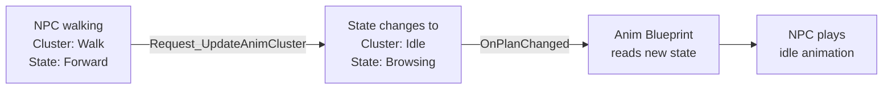

# CkAnimation

Animation management through ECS. Stores animation assets by gameplay tag, manages animation state via a hierarchical plan system (Goal → Cluster → State), and provides ECS-aware animation notifies.

## Key Concepts

- **AnimAsset** — An ECS entity wrapping a `UAnimationAsset` or `UBlendSpace`, identified by a gameplay tag. Stored as children of a parent entity.
- **AnimPlan** — A three-level state machine: **AnimGoal** (e.g., "Locomotion") → **AnimCluster** (e.g., "Walking") → **AnimState** (e.g., "Forward"). State changes are requested and replicated automatically.
- **ECS-Ready Notifies** — Custom `UCk_AnimNotify_EcsReady_UE` and `UCk_AnimNotifyState_EcsReady_UE` that fire Blueprint events with the entity's `FCk_Handle`, bridging Unreal's anim notify system to ECS.
- **Montage Utilities** — Helpers for querying section lengths, notify times, skeleton compatibility, and root motion extraction.

## Example: NPC Changes Animation State



## Usage Examples

### Add animation assets to an entity

```cpp
UCk_Utils_AnimAsset_UE::Add(ParentEntity, AnimAssetParams);
```

### Look up an animation by tag

```cpp
auto AnimAsset = UCk_Utils_AnimAsset_UE::TryGet_AnimAsset(ParentEntity, TAG_Anim_Walk);
auto Animation = UCk_Utils_AnimAsset_UE::Get_Animation(AnimAsset);
```

### Create an animation plan

```cpp
UCk_Utils_AnimPlan_UE::Add(ParentEntity, AnimPlanParams);
```

### Change animation state

```cpp
UCk_Utils_AnimPlan_UE::Request_UpdateAnimCluster(AnimPlan, TAG_Anim_Idle);
UCk_Utils_AnimPlan_UE::Request_UpdateAnimState(AnimPlan, TAG_Anim_Browsing);
```

### Listen for state changes

```cpp
UCk_Utils_AnimPlan_UE::BindTo_OnPlanChanged(AnimPlan, OnChangedDelegate);
```

### Query montage info

```cpp
auto Length = UCk_Utils_Animation_UE::Get_MontageSectionLength_ByName(Montage, "Attack");
auto RootMotion = UCk_Utils_Animation_UE::Get_RootMotion(Montage);
```

## Tests

No tests found for this module in CkTest.
