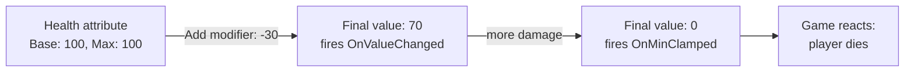

# CkAttribute

Typed numeric attributes with modifiers, min/max bounds, clamping signals, and optional refill. Four built-in types: Float, Integer, Byte, Vector. Used for things like health, mana, ammo, or any bounded value that can be modified at runtime.

## Key Concepts

- **Attribute** — An ECS entity storing a base value, final value (base + modifiers), and optional min/max bounds. Identified by gameplay tag.
- **Four Types** — `FloatAttribute`, `IntegerAttribute`, `ByteAttribute` (0–255), `VectorAttribute`. Each has its own Utils class with identical patterns.
- **Modifiers** — Applied to an attribute to change its final value. Operations: Add, Subtract, Multiply, Divide, Override. Can be **Revocable** (tagged, removable by tag) or **NotRevocable** (anonymous).
- **Clamping Signals** — `OnMinClamped` fires when the value hits minimum (e.g., health depleted). `OnMaxClamped` fires when it hits maximum (e.g., health full).
- **Refill** — Optional per-second regeneration with pause/resume control. Runs locally (not replicated).
- **Magnitude** — Derives a float value from another attribute using linear, curve, or breakpoint formulas.

## Example: Player Takes Damage



## Usage Examples

### Create a health attribute

```cpp
UCk_Utils_FloatAttribute_UE::Add(Entity, HealthParams);
```

### Read current value

```cpp
auto Health = UCk_Utils_FloatAttribute_UE::Get_FinalValue(HealthAttribute);
```

### Apply damage (revocable modifier)

```cpp
UCk_Utils_FloatAttributeModifier_UE::Add_Revocable(
    HealthAttribute, TAG_Modifier_Poison, -5.0f, ECk_AttributeModifier_Operation::Add);
```

### Remove a modifier by tag

```cpp
auto Modifier = UCk_Utils_FloatAttributeModifier_UE::TryGet(HealthAttribute, TAG_Modifier_Poison);
UCk_Utils_FloatAttributeModifier_UE::Remove(Modifier);
```

### Listen for depletion

```cpp
UCk_Utils_FloatAttribute_UE::BindTo_OnMinClamped(HealthAttribute, OnDepletedDelegate);
```

### Pause/resume refill

```cpp
UCk_Utils_FloatAttributeRefill_UE::Request_Pause(HealthAttribute);
UCk_Utils_FloatAttributeRefill_UE::Request_Resume(HealthAttribute);
```

## Tests

No tests found for this module in CkTest.
