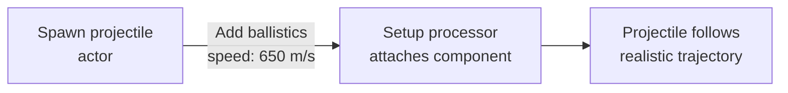

# CkBallistics

ECS wrapper for the Realistic Projectile plugin. Attaches a `URealisticProjectileComponent` to an entity's actor and configures its physics parameters (speed, terminal velocity, gravity) from ECS data.

## Key Concepts

- **Ballistics Entity** — An ECS entity with configured trajectory physics. On setup, a `URealisticProjectileComponent` is attached to the owning actor.
- **Params** — Initial speed, terminal velocity, and gravity multiplier. Set once at creation, applied by the setup processor.

## Example: Launching a Projectile



## Usage Examples

### Add ballistics to a projectile entity

```cpp
FCk_Fragment_Ballistics_ParamsData Params;
Params.Set_InitialSpeed(650.0f);
Params.Set_GravityMultiplier(1.0f);
UCk_Utils_Ballistics_UE::Add(ProjectileEntity, Params);
```

### Check if an entity has ballistics

```cpp
bool HasBallistics = UCk_Utils_Ballistics_UE::Has(Entity);
```

## Tests

No tests found for this module in CkTest.
