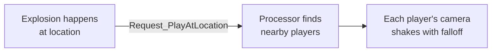

# CkCamera

ECS-driven camera shake system. Queue shake effects on specific players or at world locations with radial falloff.

## Key Concepts

- **Camera Shake Entity** — Wraps an Unreal `UCameraShakeBase` class with scale, radius, and falloff settings. Identified by gameplay tag.
- **Play on Target** — Plays the shake directly on a specific entity's player camera.
- **Play at Location** — Plays the shake at a world position. Intensity falls off from `InnerRadius` (full) to `OuterRadius` (zero) with a configurable exponent.
- **Record Pattern** — Camera shakes are stored as children of an owner entity, iterable and lookupable by tag.

## Example: Explosion Camera Shake



## Usage Examples

### Create a camera shake on an entity

```cpp
UCk_Utils_CameraShake_UE::Add(OwnerEntity, ShakeParams);
```

### Look up a shake by tag

```cpp
auto Shake = UCk_Utils_CameraShake_UE::TryGet_CameraShake(OwnerEntity, TAG_Shake_Explosion);
```

### Play at a world location

```cpp
FCk_Request_CameraShake_PlayAtLocation Request;
Request.Set_Location(ExplosionLocation);
UCk_Utils_CameraShake_UE::Request_PlayAtLocation(ShakeHandle, Request);
```

### Play on a specific player

```cpp
FCk_Request_CameraShake_PlayOnTarget Request;
Request.Set_Target(PlayerEntity);
UCk_Utils_CameraShake_UE::Request_PlayOnTarget(ShakeHandle, Request);
```

## Tests

No tests found for this module in CkTest.
