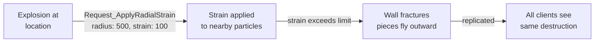

# CkChaos

ECS wrapper for Unreal's Chaos Physics destruction system. Manages GeometryCollection destructibles with radial strain, cluster crumbling, anchor removal, and network replication of destruction state.

## Key Concepts

- **GeometryCollection** — An individual destructible mesh entity. Wraps a `UGeometryCollectionComponent` and accepts radial strain requests.
- **GeometryCollectionOwner** — A parent entity that owns multiple GeometryCollections. Routes replicated requests to its children and syncs destruction across the network.
- **Radial Strain** — Applies force/damage in a radial shell around a point. Large radii are applied incrementally across multiple frames (capped per-frame).
- **Crumble** — Breaks non-anchored clusters into physics-simulated pieces.
- **Anchors** — Kinematic constraints holding clusters in place. Removing anchors lets them become dynamic.

## Example: Explosion Destroys a Wall



## Usage Examples

### Set up a destructible owner

```cpp
auto Owner = UCk_Utils_GeometryCollectionOwner_UE::Add(Entity, ECk_Replication::Replicate);
```

### Register a geometry collection

```cpp
UCk_Utils_GeometryCollection_UE::Add(OwnerHandle, GCParams);
```

### Apply radial strain (replicated)

```cpp
FCk_Request_GeometryCollectionOwner_ApplyRadialStrain_Replicated Request;
// configure origin, radius, strain, impulse...
UCk_Utils_GeometryCollectionOwner_UE::Request_ApplyRadianStrain(Owner, Request);
```

### Crumble non-anchored clusters

```cpp
UCk_Utils_GeometryCollectionOwner_UE::Request_CrumbleNonActiveClusters(Owner);
```

### Remove all anchors

```cpp
UCk_Utils_GeometryCollectionOwner_UE::Request_RemoveAllAnchors(Owner);
```

## Tests

No tests found for this module in CkTest.
