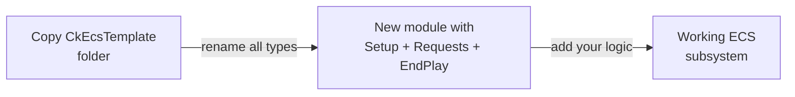

# CkEcsTemplate

Copy-paste starter template for new ECS modules. Demonstrates the standard three-processor pattern (Setup, HandleRequests, EndPlay) with fragments, requests, and utils.

## Key Concepts

- **Template Module** — Not a runtime feature. Copy this module and rename everything when creating a new ECS subsystem.
- **Three-Processor Pattern** — `Setup` (initialize on creation), `HandleRequests` (process deferred requests), `EndPlay` (cleanup on destruction).
- **Standard Fragments** — Params (config), Current (runtime state), Requests (deferred mutation queue).

## Example: Copy to Create a New Module



## Usage Examples

### Add the feature to an entity

```cpp
UCk_Utils_EcsTemplate_UE::Add(Entity, Params);
```

### Enqueue a request

```cpp
UCk_Utils_EcsTemplate_UE::Request_ExampleRequest(Handle, Request);
```

### Check if entity has the feature

```cpp
bool HasFeature = UCk_Utils_EcsTemplate_UE::Has(Entity);
```

## Tests

No tests found for this module in CkTest.
