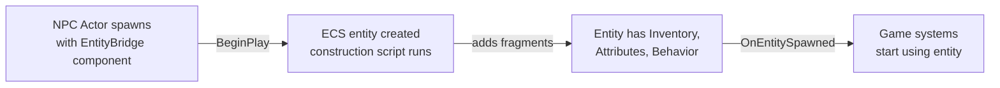

# CkEntityBridge

Connects Unreal Actors to ECS entities. Add the `UCk_EntityBridge_ActorComponent_UE` component to an Actor, configure it with a construction script data asset, and the bridge creates and manages the ECS entity's lifecycle and replication.

## Key Concepts

- **EntityBridge Component** — Actor component that creates and owns an ECS entity. Handles setup on BeginPlay and cleanup on EndPlay.
- **Config (`UCk_EntityBridge_Config_Base_PDA`)** — Data asset defining which construction script builds the entity. Decouples entity setup from Actor code.
- **Construction Script (`UCk_Entity_ConstructionScript_PDA`)** — Defines how to populate an entity's fragments after creation. Supports pre-build and post-spawn callbacks.
- **Spawn Request** — Deferred entity creation via `Request_Spawn` with optional payload and completion delegate.
- **Replication** — Entities on replicated Actors automatically get net connection settings and replication drivers.

## Example: NPC Actor Gets an ECS Entity



## Usage Examples

### Request entity spawn with callback

```cpp
FCk_Request_EntityBridge_SpawnEntity Request;
Request.Set_Config(MyConfig);
UCk_Utils_EntityBridge_UE::Request_Spawn(BridgeEntity, Request, Payload, OnSpawnedDelegate);
```

### Check if an actor's entity replicates

```cpp
auto Status = UCk_Utils_EntityBridge_UE::Get_DoesActorEntityReplicate(MyActor);
```

## Tests

No tests found for this module in CkTest.
