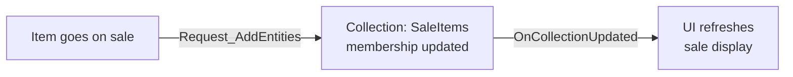

# CkEntityCollection

Named groups of entities with add/remove requests, delta detection, and replication. Fires signals when membership changes.

## Key Concepts

- **Collection** — A named entity group identified by gameplay tag. Entities can be added or removed via requests.
- **Delta Detection** — Stores previous frame's membership to compute what was added/removed this frame.
- **Replication** — Collection membership syncs from server to clients automatically.
- **Signal** — `OnCollectionUpdated` fires with added/removed entity lists when membership changes.

## Example: Dynamic Sale Items List



## Usage Examples

### Create a collection

```cpp
UCk_Utils_EntityCollection_UE::Add(OwnerEntity, CollectionParams);
```

### Add entities to a collection

```cpp
UCk_Utils_EntityCollection_UE::Request_AddEntities(CollectionHandle, EntitiesToAdd);
```

### Query membership

```cpp
auto Content = UCk_Utils_EntityCollection_UE::Get_EntitiesInCollection(CollectionHandle);
bool Contains = UCk_Utils_EntityCollection_UE::Get_ContainsEntityInCollection(CollectionHandle, Entity);
```

### React to changes

```cpp
UCk_Utils_EntityCollection_UE::BindTo_OnCollectionUpdated(CollectionHandle, OnUpdatedDelegate);
```

## Tests

No tests found for this module in CkTest.
