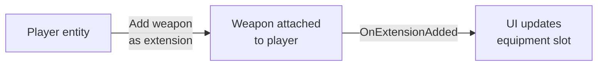

# CkEntityExtension

Attach "extension" entities to a parent entity. Signals broadcast when extensions are added or removed.

## Key Concepts

- **Extension** — An entity logically owned by a parent. Added/removed directly (no request queue).
- **Signals** — `OnEntityExtensionAdded` and `OnEntityExtensionRemoved` fire on the owner when extensions change.

## Example: Equipping a Weapon



## Usage Examples

### Attach an extension

```cpp
UCk_Utils_EntityExtension_UE::Add(OwnerEntity, WeaponEntity);
```

### Remove an extension

```cpp
UCk_Utils_EntityExtension_UE::Remove(WeaponEntity);
```

### Get owner from extension

```cpp
auto Owner = UCk_Utils_EntityExtension_UE::Get_ExtensionOwner(WeaponEntity);
```

### Iterate all extensions

```cpp
UCk_Utils_EntityExtension_UE::ForEach_EntityExtension(OwnerEntity, ForEachDelegate);
```

### Listen for changes

```cpp
UCk_Utils_EntityExtension_UE::BindTo_OnExtensionAdded(OwnerEntity, OnAddedDelegate);
UCk_Utils_EntityExtension_UE::BindTo_OnExtensionRemoved(OwnerEntity, OnRemovedDelegate);
```

## Tests

No tests found for this module in CkTest.
