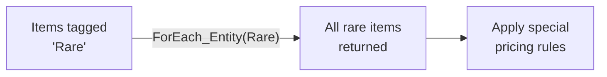

# CkEntityTag

Tag entities with FName labels and look up all entities sharing a tag. Uses per-tag EnTT storage for fast bulk queries.

## Key Concepts

- **Entity Tag** — An FName or gameplay tag attached to an entity. Multiple entities can share the same tag.
- **Per-Tag Storage** — Tags are stored in hash-partitioned EnTT storage, making "give me all entities with tag X" an O(1) lookup.
- **No Requests/Signals** — Tags are added and removed directly. No deferred processing.

## Example: Querying All Rare Items



## Usage Examples

### Tag an entity

```cpp
UCk_Utils_EntityTag_UE::Add(Entity, FName("Consumable"));
```

### Tag using a gameplay tag

```cpp
UCk_Utils_EntityTag_UE::Add_UsingGameplayTag(Entity, TAG_ItemType_Rare);
```

### Get all entities with a tag

```cpp
UCk_Utils_EntityTag_UE::ForEach_Entity(FName("Consumable"), ForEachDelegate);
```

### Remove a tag

```cpp
UCk_Utils_EntityTag_UE::Request_TryRemove(Entity, FName("Consumable"));
```

## Tests

No tests found for this module in CkTest.
