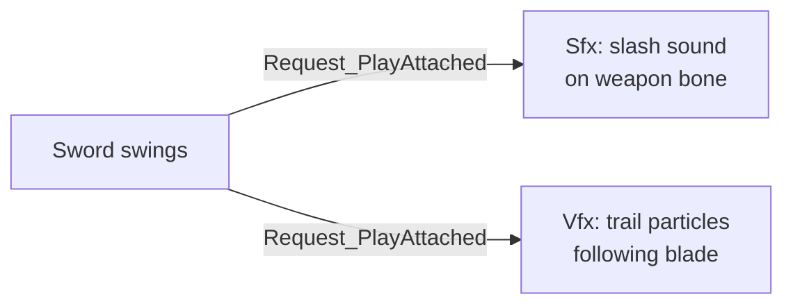

# CkFx

Sound effects (Sfx) and visual effects (Vfx) through ECS. Play audio and Niagara particles attached to entities or at world locations with configurable attachment and attenuation.

## Key Concepts

- **Sfx** — Wraps `USoundBase`. Play attached to a component (follows it) or at a world location. Configurable volume, pitch, attenuation, concurrency.
- **Vfx** — Wraps Niagara particle systems. Same attachment model as Sfx. Supports runtime instance parameter changes.
- **Attachment Policy** — Controls whether effects stay put or follow the parent, with separate rules for location, rotation, and scale.
- **Record Pattern** — Effects stored as children of an owner entity, lookupable by gameplay tag.

## Example: Sword Swing with Sound and Particles



## Usage Examples

### Add an Sfx to an entity

```cpp
UCk_Utils_Sfx_UE::Add(OwnerEntity, SfxParams);
```

### Play sound attached to a component

```cpp
UCk_Utils_Sfx_UE::Request_PlayAttached(SfxHandle, PlayRequest);
```

### Play VFX at a location

```cpp
UCk_Utils_Vfx_UE::Request_PlayAtLocation(VfxHandle, LocationRequest);
```

### Look up an effect by tag

```cpp
auto Sfx = UCk_Utils_Sfx_UE::TryGet_Sfx(OwnerEntity, TAG_Sfx_SwordSlash);
auto Vfx = UCk_Utils_Vfx_UE::TryGet_Vfx(OwnerEntity, TAG_Vfx_BladeTrail);
```

## Tests

No tests found for this module in CkTest.
