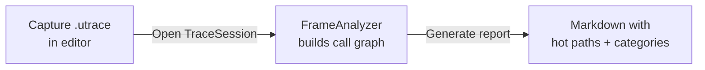

# CkInsightsAnalyzer

Parses Unreal Insights `.utrace` files and generates markdown performance reports with hot-path trees, category summaries, and per-thread breakdowns. A JSON mode emits the same data machine-readable for scripts, CI gates, and AI consumption.

The Slate editor experience is owned by CkGameplayDebugger's `CkInsightsDebugger` module. This Foundation module remains the UI-free analysis/reporting and `-run=CkInsightsAnalyzer` commandlet layer.

## Key Concepts

- **TraceSession** — Opens a `.utrace` file, exposes frame/timing/thread data for analysis, and enumerates screenshots embedded in the trace without eagerly copying their image payloads.
- **FrameAnalyzer** — Extracts timing events from frames, builds parent-child call graphs, computes inclusive/exclusive times.
- **TimerCategorizer** — Maps timer names to categories (Physics, Render, AI, etc.) and simplifies verbose function names.
- **FrameReport** — Generates Slack-friendly markdown with hot-path trees and category summaries. Configurable depth: Full (8), Standard (5), Concise (3), HotPathsOnly.
- **JsonReport** — Generates machine-readable JSON from the same analysis results (see JSON Reports below).
- **Wrapper Collapsing** — Automatically unwraps thin wrapper functions to show the real work underneath.

## Example: Analyzing a Performance Capture



## Usage Examples

### Open a trace and analyze

```cpp
auto Session = FCk_TraceSession::Open(TraceFilePath);
auto FrameData = FCk_FrameAnalyzer::AnalyzeFrame(Session, FrameIndex);
```

### Read an embedded trace screenshot

```cpp
for (const auto& Screenshot : Session.GetScreenshots())
{
    auto CompressedImage = TArray<uint8>{};
    if (Screenshot.bIsPayloadComplete && Session.TryCopyScreenshotData(Screenshot.Id, CompressedImage))
    {
        // Decode on demand. Screenshot.GameFrameIndex identifies the preceding game frame;
        // bIsInsideGameFrame says whether the timestamp is actually inside its interval.
    }
}
```

`.utrace` screenshot events contain compressed PNG or EXR bytes, dimensions, name, and timestamp.
`GetScreenshots()` returns deterministic metadata only; `TryCopyScreenshotData()` copies one complete
payload while the analysis-session read lock is held. This keeps the Foundation API UI-free and lets
the debugger create thumbnails and previews away from Slate paint/input paths.

### Generate a markdown report

```cpp
auto Report = FCk_FrameReport::Generate(FrameData, ReportConfig);
// Report is a markdown string ready for Slack/docs
```

### Categorize timers

```cpp
auto Category = FCk_TimerCategorizer::Categorize(TimerName);
auto SimpleName = FCk_TimerCategorizer::SimplifyName(TimerName);
```

## JSON Reports

The headless commandlet accepts `-json` to emit JSON instead of Slack markdown:

```
UnrealEditor-Cmd.exe <Project.uproject> -run=CkInsightsAnalyzer -trace=session.utrace -all -json -output=report.json
```

Modifiers worth knowing: `-depth=full|standard|concise|hotpaths` (detail level — previously only
settable in code), `-noscreenshots` (drop capture-polluted frames), `-timertop=N` (size the
`timerAverages` section), `-budget=<ms>`, `-raw -top=N`, `-showall`.

Conventions: schemaVersion `2`, generator metadata, times in milliseconds (3-decimal precision),
camelCase keys, and empty sections omitted. Existing consumers can continue using `worstFrames`;
multi-frame reports now add `hotFrames` with the full per-frame diagnostic shape. By default this
contains details for the five worst frames selected by `FCk_MultiFrameReportConfig::WorstFrameCount`.
Every report carries a `trace` overview (file, duration, game/render frame counts, thread list)
and `budgetMs`. Single-frame mode (`-frame=N`) adds `singleFrame`; range/worst/all modes add
`multiFrame`:

```json
{
  "schemaVersion": 2,
  "generator": { "name": "CkInsightsAnalyzer", "reportKind": "singleFrame" },
  "trace": { "file": "...", "durationSeconds": 0.0, "gameFrameCount": 0, "renderFrameCount": 0,
             "threads": [ { "id": 0, "name": "GameThread" } ] },
  "budgetMs": 16.67,
  "singleFrame": {
    "frameIndex": 0, "durationMs": 0.0,
    "callTree":   [ { "name": "...", "inclusiveMs": 0.0, "exclusiveMs": 0.0, "count": 0, "children": [] } ],
    "topTimers":  [ { "name": "...", "exclusiveMs": 0.0, "inclusiveMs": 0.0, "count": 0 } ],
    "categories": [ { "name": "...", "exclusiveMs": 0.0, "pctOfFrame": 0.0 } ],
    "workerThreads": [ { "id": 0, "name": "...", "wallTimeMs": 0.0, "eventCount": 0, "topTimers": [] } ]
  },
  "multiFrame": {
    "frameCount": 0, "avgMs": 0.0, "minMs": 0.0, "maxMs": 0.0, "p95Ms": 0.0, "p99Ms": 0.0,
    "worstFrames": [ { "frameIndex": 0, "durationMs": 0.0, "dominantCost": "...", "dominantCostMs": 0.0 } ],
    "hotFrames": [ {
      "frameIndex": 0, "durationMs": 0.0, "dominantCost": "...", "dominantCostMs": 0.0,
      "callTree": [], "topTimers": [], "categories": [], "workerThreads": [], "waitBreakdown": []
    } ],
    "categoryAverages": [ { "name": "...", "avgExclusiveMs": 0.0, "p95ExclusiveMs": 0.0, "pctOfTotal": 0.0 } ],
    "timerAverages": [ { "name": "...", "category": "...", "avgExclusiveMs": 0.0, "p95ExclusiveMs": 0.0,
                         "maxExclusiveMs": 0.0, "avgInclusiveMs": 0.0, "avgCount": 0.0, "framesPresent": 0 } ],
    "excludedScreenshotFrames": 0
  }
}
```

### `timerAverages` — the per-timer view across EVERY analysed frame

`hotFrames[].topTimers` describes one outlier frame each, so it cannot answer "what is this category
actually made of on a **typical** frame" — the question you hit the moment a category like "Other"
turns out to be the biggest one. `timerAverages` answers it.

Rows are sorted by `avgExclusiveMs` descending and capped at
`FCk_MultiFrameReportConfig::TimerAverageCount` (Full 250 / Standard 100 / Concise 50 / HotPathsOnly
disabled; `-timertop=N` overrides). Rows below `MinTimerAverageMs` (0.005 ms) are dropped.

**Averages divide by the analysed frame count, not by `framesPresent`** — a timer absent from a
frame contributes zero for that frame. That is what makes `avgExclusiveMs` read as "cost this timer
adds to a typical frame" and lets rows sum toward `avgMs`. `framesPresent` distinguishes a steady
per-frame cost from a rare expensive one; `avgCount` is fractional for timers that do not fire every
frame.

Each row carries its own `category`, so a consumer can re-bin without re-implementing
`FCk_TimerCategorizer` — worth doing, since the categorizer is keyword-based and will always trail
new scope names.

`excludedScreenshotFrames` is present only when `-noscreenshots` actually skipped frames.

## Screenshot frames are capture cost, not game cost

A trace screenshot stalls the game thread for 20+ ms in `FlushRenderingCommands` waiting out the
readback, on top of a `ScreenshotTracing_Prepare` scope. Left in, those frames own the worst-frame
ranking and inflate `maxMs`/`p99Ms` — the analyzer ends up reporting on its own capture tooling.
`-noscreenshots` (or `FCk_MultiFrameReportConfig::ExcludeScreenshotFrames`) drops any frame
containing a screenshot scope and reports how many were dropped.

Excluded frames leave the divisor too: `frameCount` is the number of frames actually analysed, so
excluding frames does not silently deflate every average.

## Categorization is keyword-based and will trail reality

`FCk_TimerCategorizer` matches categories **in registration order, first keyword hit wins**. Two
consequences worth knowing before adding a keyword:

- A keyword added to a high-priority category (Slate/UI is third) silently re-homes rows that
  already had a category, which breaks A/B continuity against previously captured reports. Prefer
  leaving a row in "Other" over stealing it. `CkTimerCategorizer.spec.cpp` pins both directions.
- Scope names that carry no category token land in "Other" regardless of what they are. Before
  concluding that "Other" is unattributed engine work, check `timerAverages[].name` — it is usually
  known work with an unhelpful scope name.

Known residual: `Scheduler::MainPass` matches Rendering's `MainPass` keyword. It is ~0.04 ms
exclusive, and narrowing Rendering would mis-bin Nanite's own bare `MainPass` RDG scope.

Unlike the markdown hot-path tree, `callTree` is the **true aggregated call tree** built from raw
timing events (merged by call path, raw timer names, no wrapper collapsing), pruned below the
config's `MinInclusiveMs` — pruned children still count toward their parent's totals. The one
naming exception: `workerThreads[].topTimers` reuses the shared summary computation and carries
simplified names, matching the markdown report.

## Tests

`Ck.CkInsightsAnalyzer.TimerCategorizer.*` (`Core/CkTimerCategorizer.spec.cpp`) pins categorization
in both directions: real capture scope names that must not fall through to "Other", and existing
attributions that a newly added keyword must not steal.

The CkGameplayDebugger-focused `Ck.InsightsDebugger` automation suite exercises the public trace-session
screenshot failure contract. Its real-renderer capture round trip additionally verifies named screenshot
events, complete embedded payloads, game-frame mapping, and on-demand payload copying.
