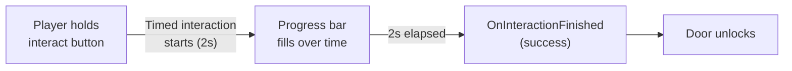

# CkInteraction

Interaction system between source and target entities. Supports instant, timed, and manually-completed interactions with channel-based intent resolution and priority sorting.

## Key Concepts

- **Interaction** — An ECS entity linking a source and target with a completion policy: Instant, Timed (duration-based), or ManuallyCompleted.
- **InteractionSource** — Entity that initiates interactions on a channel. Controls concurrency and sorting.
- **InteractTarget** — Candidate target for interactions. Managed by the resolver for priority selection.
- **InteractionResolver** — Maps gameplay tag intents to channels, maintains best targets per intent based on distance.
- **Signals** — `OnInteractionFinished` fires with success/failure when an interaction completes.

## Example: Player Opens a Door



## Usage Examples

### Start an interaction

```cpp
UCk_Utils_Interaction_UE::Add(OwnerEntity, InteractionParams);
```

### End an interaction manually

```cpp
UCk_Utils_Interaction_UE::Request_EndInteraction(InteractionHandle, EndRequest);
```

### Query interaction state

```cpp
auto Distance = UCk_Utils_Interaction_UE::Get_InteractionDistance(InteractionHandle);
auto Elapsed = UCk_Utils_Interaction_UE::Get_TimeElapsed(InteractionHandle);
```

### Listen for completion

```cpp
UCk_Utils_Interaction_UE::BindTo_OnInteractionFinished(InteractionHandle, OnFinishedDelegate);
```

## Tests

No tests found for this module in CkTest.
