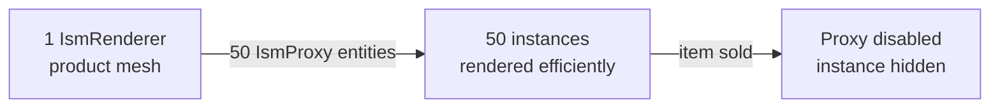

# CkIsmRenderer

Manages Instanced Static Mesh (ISM/HISM) rendering through ECS. Renders many identical meshes with one component instead of one actor per instance. Supports per-instance custom data, transforms, and enable/disable.

## Key Concepts

- **IsmRenderer** — Central entity managing one ISM/HISM component. Configurable mesh, materials, mobility, collision, shadows.
- **IsmProxy** — Lightweight ECS entity representing one mesh instance. Holds local offset, rotation, scale, and custom instance data.
- **Custom Data** — Per-instance data readable by shaders (e.g., color, price tier). Set via requests.
- **Mobility** — Static renderers batch-update once. Movable renderers update per-frame.
- **Enable/Disable** — Proxies can be hidden without being destroyed.

## Example: Store Shelf with 50 Products



## Usage Examples

### Create a renderer

```cpp
UCk_Utils_IsmRenderer_UE::Add(OwnerEntity, RendererParams);
```

### Add an instance proxy

```cpp
UCk_Utils_IsmProxy_UE::Add(RendererHandle, ProxyParams);
```

### Update per-instance custom data

```cpp
UCk_Utils_IsmProxy_UE::Request_SetCustomInstanceData(ProxyHandle, CustomData);
```

### Disable an instance

```cpp
UCk_Utils_IsmProxy_UE::Request_EnableDisable(ProxyHandle, false);
```

### Query instance count

```cpp
int32 Count = UCk_Utils_IsmRenderer_UE::Get_CurrentInstanceCount(RendererHandle);
```

## Tests

No tests found for this module in CkTest.
