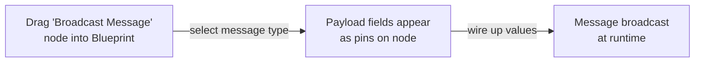

# CkK2Nodes

Custom Blueprint editor nodes for ECS features. Provides visual nodes for AbilityCues, InstancedStruct variables, DynamicFragments, and Messaging with compact/expanded payload pin modes.

## Key Concepts

- **K2Node** — Custom Blueprint graph node. Inherits from `UK2Node_CallFunction` with custom Slate widgets for rendering.
- **Compact vs Expanded** — Compact mode shows a single payload pin. Expanded mode breaks out individual struct fields directly on the node.
- **Message Nodes** — `Broadcast` and `Listen` nodes for the CkMessaging pub-sub system, with type-safe payload expansion.
- **DynamicFragment Nodes** — Get/Add/AddOrGet nodes with struct type selector dropdown.

## Example: Broadcasting a Message in Blueprint

## Usage Examples

These are editor-only nodes used in Blueprint graphs. No C++ API to call directly — the nodes generate standard function calls to `UCk_Utils_Messaging_UE::Broadcast()`, `UCk_Utils_AbilityCue_UE::Make_*()`, etc.

### Available node types

- `UCk_K2Node_Message_Broadcast` / `UCk_K2Node_Message_Listen` — Messaging
- `UCk_K2Node_AbilityCue_MakeParamsWithCustomData` — AbilityCue params
- `UCk_K2Node_Variables_GetInstancedStruct` / `SetInstancedStruct` — InstancedStruct access
- `UCkDynamicFragment_K2Node` / `UCkDynamicFragment_Add_K2Node` — DynamicFragment operations

## Tests

No tests found for this module in CkTest.
