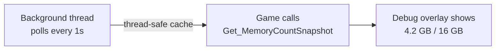

# CkMemory

Tracks system memory usage (physical, virtual, RHI) via a background thread and exposes snapshots through a Blueprint-accessible subsystem.

## Key Concepts

- **Background Thread** — A `FRunnable` polls `FPlatformMemory::GetStats()` every second. Thread-safe snapshot caching.
- **Memory Snapshot** — Struct with physical/virtual/RHI used/available/total values.
- **Stats Build Only** — Tracking is compiled out in non-stats builds (`#if STATS`).

## Example: Displaying Memory Usage



## Usage Examples

### Get current memory stats

```cpp
auto Snapshot = UCk_Utils_Memory_UE::Get_MemoryCountSnapshot();
// Snapshot._PhysicalUsed, Snapshot._PhysicalTotal, Snapshot._RHIUsed, etc.
```

## Tests

No tests found for this module in CkTest.
