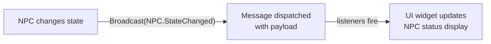

# CkMessaging

Pub-sub messaging system through ECS. Entities broadcast tagged messages with payloads, and other entities listen via delegates. Decouples senders from receivers.

## Key Concepts

- **Broadcast** — Send a message (gameplay tag + optional payload) from an entity. A messenger entity is lazily created per message type.
- **Listen** — Bind a delegate to receive broadcasts of a specific message tag. Returns a listener handle to unbind later.
- **Message Definition (`UCk_Message_Definition_PDA`)** — Data asset defining the message tag and payload struct type.
- **Payload** — Optional `FInstancedStruct` data sent with the message. K2Nodes can expand struct fields into Blueprint pins.

## Example: NPC State Change Notification



## Usage Examples

### Broadcast a message

```cpp
UCk_Utils_Messaging_UE::Broadcast(SenderEntity, TAG_Message_NPC_StateChanged, Payload);
```

### Listen for a message

```cpp
auto Listener = UCk_Utils_Messaging_UE::BindTo_OnBroadcast(
    ListenerEntity, TAG_Message_NPC_StateChanged, OnMessageDelegate);
```

### Stop listening

```cpp
UCk_Utils_MessageListener_UE::Stop(ListenerHandle);
```

## Tests

No tests found for this module in CkTest.
