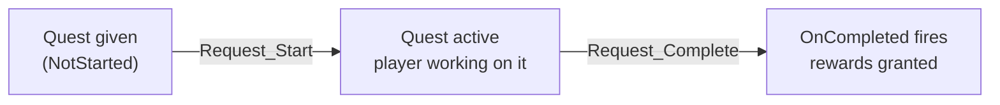

# CkObjective

Quest/objective lifecycle management. Entities can own objectives, transition them through states (NotStarted → Active → Completed/Failed), and react via signals.

## Key Concepts

- **Objective** — An ECS entity with a status: NotStarted, Active, Completed, or Failed. Identified by gameplay tag with display name and description.
- **ObjectiveOwner** — Parent entity that holds a collection of objectives. Can auto-spawn default objectives on setup.
- **State Transitions** — Driven by requests: `Start`, `Complete`, `Fail`. Processors update status and fire signals.
- **Signals** — `OnStatusChanged`, `OnCompleted`, `OnFailed` broadcast when objectives transition.

## Example: Player Completes a Quest



## Usage Examples

### Add an objective owner

```cpp
UCk_Utils_ObjectiveOwner_UE::Add(PlayerEntity, OwnerParams);
```

### Start an objective

```cpp
UCk_Utils_Objective_UE::Request_Start(ObjectiveHandle);
```

### Complete an objective

```cpp
UCk_Utils_Objective_UE::Request_Complete(ObjectiveHandle);
```

### Listen for completion

```cpp
UCk_Utils_Objective_UE::BindTo_OnCompleted(ObjectiveHandle, OnCompletedDelegate);
```

### Query status

```cpp
auto Status = UCk_Utils_Objective_UE::Get_Status(ObjectiveHandle);
```

## Tests

No tests found for this module in CkTest.
