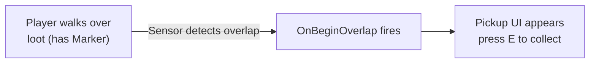

# CkOverlapBody

Overlap detection with Markers (tagged collision volumes) and Sensors (detectors). Fires signals when overlaps begin and end, with separate paths for tagged markers vs generic actors.

## Key Concepts

- **Marker** — Passive collision volume attached to an actor (Box, Sphere, Capsule). Tagged with gameplay tags for filtering.
- **Sensor** — Active detector that reports overlaps with Markers and non-Marker actors separately.
- **Marker vs Non-Marker Overlaps** — Marker overlaps include tag-based filtering and ECS handle resolution. Non-marker overlaps are generic actor overlaps.
- **Signals** — `OnBeginOverlap` / `OnEndOverlap` for both marker and non-marker paths.
- **Bone Attachment** — Markers and sensors can attach to skeletal mesh bones.

## Example: Loot Pickup Detection



## Usage Examples

### Add a sensor to an entity

```cpp
UCk_Utils_Sensor_UE::Add(OwnerEntity, SensorParams);
```

### Listen for overlaps

```cpp
UCk_Utils_Sensor_UE::BindTo_OnBeginOverlap(SensorHandle, OnOverlapDelegate);
UCk_Utils_Sensor_UE::BindTo_OnEndOverlap(SensorHandle, OnEndDelegate);
```

### Query current overlaps

```cpp
int32 MarkerCount = UCk_Utils_Sensor_UE::Get_MarkerOverlapCount(SensorHandle);
int32 NonMarkerCount = UCk_Utils_Sensor_UE::Get_NonMarkerOverlapCount(SensorHandle);
```

### Enable/disable at runtime

```cpp
UCk_Utils_Sensor_UE::Request_EnableDisable(SensorHandle, false);
```

## Tests

No tests found for this module in CkTest.
