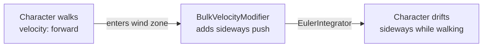

# CkPhysics

Lightweight ECS-based movement: velocity, acceleration, Euler integration, auto-reorientation, and bulk velocity modifiers (e.g., wind zones).

## Key Concepts

- **Velocity** — Directional motion vector. Local (relative to entity rotation) or World space. Supports min/max speed clamping.
- **Acceleration** — Constant velocity change per frame, independent of velocity.
- **EulerIntegrator** — Processor that applies velocity + acceleration to update position each frame.
- **AutoReorient** — Rotates entity to face its velocity direction. Snap or interpolated.
- **VelocityModifier** — Per-entity velocity override.
- **BulkVelocityModifier** — Affects a dynamic set of entities via gameplay tag channels (e.g., a "Wind" zone that pushes all entities in range).
- **PredictedVelocity** — Caches velocity for next-frame lookahead (used by animation).

## Example: Character Moving with Wind



## Usage Examples

### Add velocity to an entity

```cpp
UCk_Utils_Velocity_UE::Add(Entity, VelocityParams);
```

### Set velocity

```cpp
UCk_Utils_Velocity_UE::Request_OverrideVelocity(VelocityHandle, NewVelocity);
```

### Read current velocity

```cpp
auto Vel = UCk_Utils_Velocity_UE::Get_CurrentVelocity(VelocityHandle);
```

### Add auto-reorientation

```cpp
UCk_Utils_AutoReorient_UE::Add(Entity, AutoReorientParams);
```

### Create a bulk velocity modifier (wind zone)

```cpp
UCk_Utils_BulkVelocityModifier_UE::Add(ZoneEntity, WindParams);
UCk_Utils_BulkVelocityModifier_UE::Request_AddTarget(ZoneEntity, CharacterEntity);
```

## Tests

No tests found for this module in CkTest.
