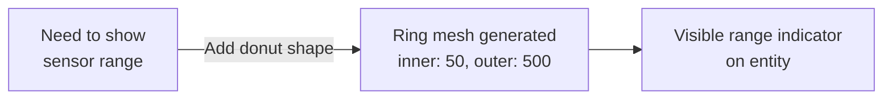

# CkPmg

Procedural mesh generation for debug visualization and runtime shapes. Generates donuts, spheres, boxes, cones, cylinders, and 30+ icon shapes using `UProceduralMeshComponent`.

## Key Concepts

- **Donut Shape** — 2D ring with configurable inner/outer radius, segments, and fill angle. Main production use case.
- **Debug Shapes** — 30+ shapes (Sphere, Box, Cone, Arrow, Star, Checkmark, Warning, etc.) for visual debugging with color, duration, and render mode.
- **Render Mode** — SingleSided, DoubleSided, or Hidden.

## Example: Visualizing a Sensor Range



## Usage Examples

### Create a donut shape

```cpp
UCk_Utils_Pmg_Donut_UE::Add(Entity, DonutParams);
```

### Update donut at runtime

```cpp
UCk_Utils_Pmg_Donut_UE::Request_SetOuterRadius(DonutHandle, 600.0f);
UCk_Utils_Pmg_Donut_UE::Request_SetFillAngle(DonutHandle, 270.0f);
UCk_Utils_Pmg_Donut_UE::Request_SetMaterial(DonutHandle, NewMaterial);
```

## Tests

No tests found for this module in CkTest.
