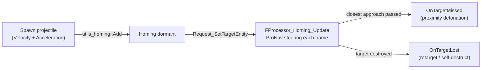

# CkProjectile

Projectile movement (Euler-integrated and closed-form ballistic), aim-ahead/firing-solution math, and proportional-navigation homing.

## Key Concepts

- **Aim-Ahead / Firing Solution** — Given shooter location+velocity, projectile speed, target location+velocity, computes the point to aim at (and the time to impact) so a constant-speed projectile intercepts the target. Handles moving shooters, equal-speed degenerate cases, and both-roots geometries (earliest/latest preference).
- **Aim-Ahead Plus One Frame** — Adds one frame of target velocity for more accurate prediction.
- **Request-Response** — Calculation is enqueued as a request. Processor solves and broadcasts the result via delegate with success/failure status, aim point, and time to impact.
- **Homing (Proportional Navigation)** — `Homing/` feature steers a Velocity+Acceleration entity onto a collision course by nulling the line-of-sight rotation rate. The LOS angular velocity is computed analytically (`Ω = (R × Vrel) / |R|²`) so guidance is framerate-independent. Supports turn-only (fin-steered) and turn+thrust (motorized) modes, gravity compensation, desired time-to-impact, miss detection, and target-lost notification.
- **Deterministic Ballistics** — `Ballistic/` + `BallisticMotion/` evaluate closed-form Carpentier linear-drag trajectories from (initial conditions, time); foundation for lag compensation.

## Example: Missile Chasing an Evading Target



## Usage Examples

### Homing projectile

```cpp
// Entity must already have Velocity + Acceleration + Transform (e.g. via UCk_Utils_Projectile_UE::Add)
auto Settings = FCk_Homing_GuidanceSettings{2000.0f};   // max acceleration budget, cm/s²
Settings.Set_NavigationGain(4.0f);
auto Homing = UCk_Utils_Homing_UE::Add(Entity, FCk_Fragment_Homing_ParamsData{Settings});

UCk_Utils_Homing_UE::Request_SetTargetEntity(Homing, FCk_Request_Homing_SetTargetEntity{TargetEntity});
UCk_Utils_Homing_UE::BindTo_OnTargetMissed(Homing, MissedDelegate);
```

### Calculate a firing solution (pure math, no entity needed)

```cpp
const auto Solution = ck::pronav::Compute_FiringSolution(
    ShooterLocation, ShooterVelocity, TargetLocation, TargetVelocity, ProjectileSpeed);
// Solution.Get_Result() / Get_ImpactLocation() / Get_TimeToImpact()
```

### Calculate aim-ahead point (deferred request)

```cpp
FCk_Request_Projectile_CalculateAimAhead Request;
// set projectile origin, speed, target location, target velocity (+ optional shooter velocity)
UCk_Utils_Projectile_UE::Request_CalculateAimAhead(ProjectileHandle, Request, OnResultDelegate);
// Delegate receives: ECk_SucceededFailed + aim point + time to impact
```

### Add projectile feature to entity

```cpp
UCk_Utils_Projectile_UE::Add(Entity, ProjectileParams);
```

## Tests

- **C++ unit tests** (`CkTests/Source/CkTests/Private/UnitTests/CkProjectile/`): `Test_CkHoming_ProNav.cpp` (guidance-law properties + closed-loop intercept simulations incl. weaving targets, framerate robustness, gravity compensation, desired impact time), `Test_CkHoming_FiringSolution.cpp` (intercept-solver edge cases), `Test_CkBallistic_LinearDrag.cpp`.
- **AS AutoTests** (`CkTests/Script/CkProjectile/`): `CkAutoTest_Homing_*` — feature attach, distance closing, miss signal, target-lost signal, clear-target stops steering.
