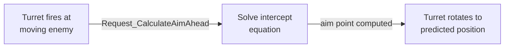

# CkProjectile

Aim-ahead calculation for projectiles targeting moving entities. Solves quadratic targeting equations to compute where to aim so a constant-speed projectile intercepts a moving target.

## Key Concepts

- **Aim-Ahead** — Given projectile speed, target location, and target velocity, computes the point where the projectile will intercept the target.
- **Aim-Ahead Plus One Frame** — Adds one frame of target velocity for more accurate prediction.
- **Request-Response** — Calculation is enqueued as a request. Processor solves and broadcasts the result via delegate with success/failure status and aim point.

## Example: Turret Aiming at Moving Enemy



## Usage Examples

### Calculate aim-ahead point

```cpp
FCk_Request_Projectile_CalculateAimAhead Request;
// set projectile origin, speed, target location, target velocity
UCk_Utils_Projectile_UE::Request_CalculateAimAhead(ProjectileHandle, Request, OnResultDelegate);
// Delegate receives: ECk_SucceededFailed + aim point
```

### Add projectile feature to entity

```cpp
UCk_Utils_Projectile_UE::Add(Entity, ProjectileParams);
```

## Tests

No tests found for this module in CkTest.
