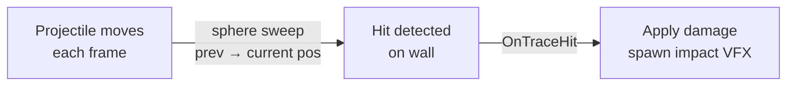

# CkRaySense

Continuous collision tracing sensor. Performs line, box, sphere, capsule, or cylinder sweeps from previous to current frame position and fires signals on hit.

## Key Concepts

- **Shape Variants** — Line trace (simple ray) or swept shapes (Box, Sphere, Capsule, Cylinder).
- **Collision Quality** — Discrete (point check at current position) or Sweep (continuous motion trace between frames).
- **Collision Response** — Overlap (signal only) or Collide (signal + move entity to impact point).
- **Ignore Lists** — Exclude specific actors, components, or ECS entities from traces.
- **Hit Signal** — `OnRaySenseTraceHit` broadcasts with impact point, normal, hit actor/component/handle, and physical material.

## Example: Projectile Collision Detection



## Usage Examples

### Add a ray sense to an entity

```cpp
UCk_Utils_RaySense_UE::Add(Entity, RaySenseParams);
```

### Listen for hits

```cpp
UCk_Utils_RaySense_UE::BindTo_OnTraceHit(RaySenseHandle, OnHitDelegate);
```

### Enable/disable tracing

```cpp
UCk_Utils_RaySense_UE::Request_EnableDisable(RaySenseHandle, false);
```

## Tests

No tests found for this module in CkTest.
