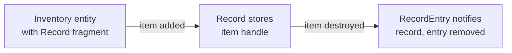

# CkRecord

Generic container for managing collections of entities within other entities. Entries auto-clean up when destroyed. Used internally by many modules (Inventory, Animation, Aggro, etc.) to track parent-child entity relationships.

## Key Concepts

- **Record** — A template-based fragment that stores a list of entity handles. Defined via `CK_DEFINE_RECORD_OF_ENTITIES`.
- **RecordEntry** — Companion fragment on child entities that tracks which records contain them. Enables automatic cleanup on destruction.
- **Lazy Cleanup** — Invalid entries are removed on-the-fly during iteration.

## Example: Inventory Tracking Items



## Usage Examples

### Query entries

```cpp
auto Count = TUtils_Record<FFragment_RecordOfItems>::Get_ValidEntriesCount(RecordOwner);
auto Entries = TUtils_Record<FFragment_RecordOfItems>::Get_ValidEntries(RecordOwner);
```

### Iterate entries

```cpp
TUtils_Record<FFragment_RecordOfItems>::ForEach_ValidEntry(RecordOwner, [](auto& Entry) {
    // process each valid entry
});
```

### Check membership

```cpp
bool Contains = TUtils_Record<FFragment_RecordOfItems>::Get_ContainsEntry(RecordOwner, ItemHandle);
```

## Tests

No tests found for this module in CkTest.
