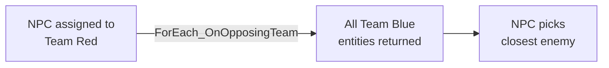

# CkRelationship

Player and team ownership for entities. Assign entities to players/teams, query relationships (friendly, hostile, neutral), and iterate entities by team affiliation.

## Key Concepts

- **Player** — Assigns an entity to a player ID. Fast ECS queries via compile-time ID tags.
- **Team** — Assigns an entity to a team. Same pattern as Player.
- **Attitude** — Evaluates stance between entities: Friendly, Hostile, or Neutral.
- **Signals** — Delegates fire on team/player assignment changes.

## Example: Finding All Enemies



## Usage Examples

### Assign entity to a team

```cpp
UCk_Utils_Team_UE::Assign(Entity, TeamID);
```

### Find all opposing team members

```cpp
UCk_Utils_Team_UE::ForEachEntity_OnOpposingTeam(Entity, ForEachDelegate);
```

### Check attitude toward another entity

```cpp
auto Attitude = UCk_Utils_Relationship_UE::Get_AttitudeTowards(EntityA, EntityB);
```

### Listen for team changes

```cpp
UCk_Utils_Player_UE::BindTo_OnTeamChanged(Entity, OnChangedDelegate);
```

## Tests

No tests found for this module in CkTest.
