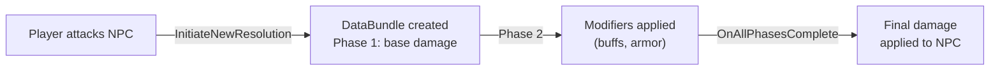

# CkResolver

Multi-phase event resolution system. Source entities initiate resolution against targets through a DataBundle that processes operations in ordered phases (e.g., base damage → modifiers → final result).

## Key Concepts

- **Source / Target / DataBundle** — Three-entity pattern. Source instigates, Target receives, DataBundle holds shared state and phases.
- **Phases** — Operations are queued for the current or next phase. Phases complete sequentially. Signals fire at phase boundaries.
- **Operations** — Modifier (numeric adjustment with tag conditions) or Metadata (tag-based flag setting).
- **Signals** — `OnPhaseStart`, `OnPhaseComplete`, `OnAllPhasesComplete` for hooking into the resolution pipeline.

## Example: Damage Resolution



## Usage Examples

### Initiate a resolution

```cpp
UCk_Utils_ResolverSource_UE::Request_InitiateNewResolution(SourceEntity, ResolutionRequest);
```

### Add a modifier operation

```cpp
UCk_Utils_ResolverDataBundle_UE::Request_AddOperation_Modifier(Bundle, ModifierOp);
```

### Listen for completion

```cpp
UCk_Utils_ResolverDataBundle_UE::BindTo_OnAllPhasesComplete(Bundle, OnCompleteDelegate);
```

### Read final value

```cpp
auto FinalValue = UCk_Utils_ResolverDataBundle_UE::Get_FinalValue(Bundle);
```

## Tests

No tests found for this module in CkTest.
