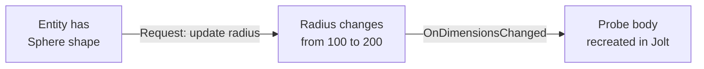

# CkShapes

Polymorphic shape system (Box, Sphere, Capsule, Cylinder) with dimension tracking, request-based updates, and Jolt Physics integration for spatial queries.

## Key Concepts

- **Four Shape Types** — Box, Sphere, Capsule, Cylinder. Each has its own type-safe handle, params, and processor.
- **FCk_AnyShape** — Union struct that can hold any of the four shape types. Factory methods: `Make_Box()`, `Make_Sphere()`, etc.
- **Dimension Updates** — Requests change shape dimensions at runtime. Change signals broadcast so dependent systems (like CkSpatialQuery probes) can react.
- **Jolt Binding** — Shapes convert to Jolt physics objects for collision queries.

## Example: Expanding an Interaction Radius



## Usage Examples

### Add a sphere shape

```cpp
UCk_Utils_ShapeSphere_UE::Add(Entity, SphereParams);
```

### Create an AnyShape

```cpp
auto Shape = UCk_Utils_Shape_UE::Make_Sphere(Radius);
auto Shape = UCk_Utils_Shape_UE::Make_Box(HalfExtents);
```

### Query shape type

```cpp
auto Type = UCk_Utils_Shape_UE::Get_ShapeType(Entity); // ECk_Shape_Type
```

## Tests

No tests found for this module in CkTest.
