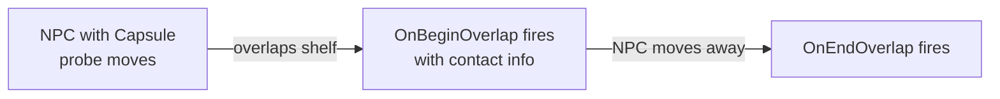

# CkSpatialQuery

Collision probes using Jolt Physics. Persistent shapes in the physics world that track overlaps each frame, plus one-shot line traces and shape casts.

## Key Concepts

- **Probe** — An ECS entity with a Jolt physics body. Tracks overlaps with other probes and fires signals on begin/update/end.
- **Motion Types** — Static, Kinematic, or Dynamic bodies. LinearCast (CCD) for fast-moving objects.
- **Response Policy** — `Notify` (fire signals on overlap) or `Silent` (no callbacks).
- **Context Overlap Policy** — Controls whether probes overlap with same-context or different-context probes.
- **Persistent Traces** — Long-lived line/shape casts that update every frame.
- **Debug Draw** — Optional visualization with configurable colors per state.

## Example: NPC Overlap Detection



## Usage Examples

### Add a probe to an entity

```cpp
UCk_Utils_Probe_UE::Add(TransformEntity, ProbeParams, DebugInfo);
```

### Listen for overlaps

```cpp
UCk_Utils_Probe_UE::BindTo_OnBeginOverlap(ProbeHandle, OnBeginDelegate);
UCk_Utils_Probe_UE::BindTo_OnEndOverlap(ProbeHandle, OnEndDelegate);
```

### One-shot line trace

```cpp
auto Result = UCk_Utils_Probe_UE::Request_SingleLineTrace(ProbeHandle, TraceRequest);
```

### Enable/disable probe

```cpp
UCk_Utils_Probe_UE::Request_EnableDisable(ProbeHandle, false);
```

### Check overlap state

```cpp
bool Overlapping = UCk_Utils_Probe_UE::Get_IsOverlapping(ProbeHandle);
```

## Tests

No tests found for this module in CkTest.
