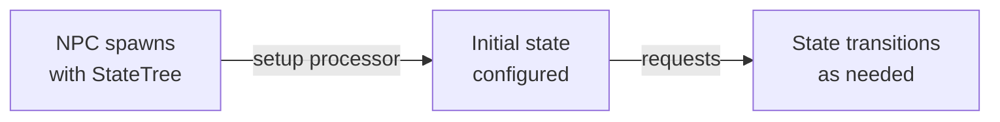

# CkStateTree

ECS feature for state machine management with setup, request handling, and lifecycle processors. Currently a scaffold — add custom states and transitions to fit your needs.

## Key Concepts

- **StateTree Entity** — An ECS entity with params, current state, and request queue. Follows the standard three-processor pattern (Setup, HandleRequests, EndPlay).
- **Optional Replication** — Can be created with or without network sync.

## Example: NPC Behavior States



## Usage Examples

### Add state tree to an entity

```cpp
UCk_Utils_StateTree_UE::Add(Entity, StateTreeParams);
```

### Check if entity has state tree

```cpp
bool Has = UCk_Utils_StateTree_UE::Has(Entity);
```

## Tests

No tests found for this module in CkTest.
