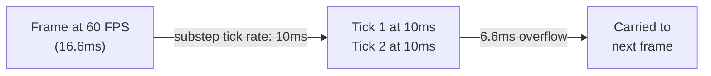

# CkSubstep

Fixed-timestep sub-stepping for deterministic updates. Decouples fixed tick rate from variable frame rate, with overflow carried between frames.

## Key Concepts

- **Fixed Tick Rate** — Updates run at a fixed interval regardless of frame rate. Overflow accumulates and carries to the next frame.
- **Three Signals** — `OnSubstepFirstUpdate` (first tick in a frame), `OnSubstepUpdate` (every fixed tick), `OnSubstepFrameEnd` (after all ticks in a frame).
- **Pause/Resume** — Sub-stepping can be paused and resumed at runtime.

## Example: Fixed-Rate Physics Update



## Usage Examples

### Add sub-stepping to an entity

```cpp
UCk_Utils_Substep_UE::Add(Entity, SubstepParams); // e.g., 0.01f tick rate
```

### Bind to update signal

```cpp
UCk_Utils_Substep_UE::BindTo_OnUpdate(SubstepHandle, OnTickDelegate);
```

### Pause/resume

```cpp
UCk_Utils_Substep_UE::Request_Pause(SubstepHandle);
UCk_Utils_Substep_UE::Request_Resume(SubstepHandle);
```

## Tests

No tests found for this module in CkTest.
