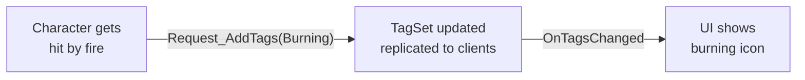

# CkTagSet

Replicated gameplay tag container on ECS entities. Add/remove tags via requests, listen for changes, auto-syncs to clients.

## Key Concepts

- **TagSet** — A `FGameplayTagContainer` stored as an ECS fragment. Mutations go through requests (authority only).
- **Replication** — Tag changes sync from server to clients automatically.
- **Signal** — `OnTagsChanged` fires with added and removed tag lists.

## Example: Tracking Status Effects



## Usage Examples

### Create a tag set

```cpp
UCk_Utils_TagSet_UE::Add(Entity, InitialTags, ECk_Replication::Replicate);
```

### Add/remove tags

```cpp
UCk_Utils_TagSet_UE::Request_AddTags(TagSetHandle, NewTags);
UCk_Utils_TagSet_UE::Request_RemoveTag(TagSetHandle, TagToRemove);
```

### Query tags

```cpp
bool HasTag = UCk_Utils_TagSet_UE::HasTag(TagSetHandle, TAG_Status_Burning);
auto AllTags = UCk_Utils_TagSet_UE::Get_Tags(TagSetHandle);
```

### Listen for changes

```cpp
UCk_Utils_TagSet_UE::BindTo_OnTagsChanged(TagSetHandle, OnChangedDelegate);
```

## Tests

No tests found for this module in CkTest.
