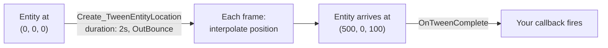

# CkTween

Tweening system for CkFoundation. Smoothly animates values (float, vector, rotator, color) between start and end over a duration, with easing, looping, chaining, and dynamic target following.
## Key Concepts

- **Tween** — An ECS entity that interpolates a value over time. You get back an `FCk_Handle_Tween` to control it.
- **Easing** — 33 curves: Linear + 10 families (Sine, Quad, Cubic, Quart, Quint, Expo, Circ, Back, Elastic, Bounce) each with In/Out/InOut. Default is `OutCubic`.
- **Looping** — `None` (play once), `Restart` (replay from start), `Yoyo` (reverse). Loop count: `-1` infinite, `0` none, `>0` specific. Yoyo supports a delay between reversals.
- **Chaining** — Queue tweens to play one after another, with optional delay between them.
- **Follow Target** — End value can be a live entity reference instead of a fixed value. The tween resolves the target's transform each frame, so it tracks moving things.
- **Signals** — `OnTweenUpdate` (every frame), `OnTweenComplete` (done or stopped), `OnTweenLoop` (each loop). Bind delegates to react.

## Example: Moving an Entity Over Time



## Usage Examples

### Move an entity somewhere

```cpp
UCk_Utils_Tween_UE::Create_TweenEntityLocation(
    EntityTransformHandle,
    FVector(500.0, 0.0, 100.0),
    2.0f,
    ECk_TweenEasing::OutBounce);
```

### Animate a float with callback

```cpp
auto Tween = UCk_Utils_Tween_UE::Create_TweenFloat(
    OwnerEntity, 1.0f, 0.0f, 0.5f, ECk_TweenEasing::InOutQuad);

UCk_Utils_Tween_UE::BindTo_OnUpdate(Tween, OnUpdateDelegate);
UCk_Utils_Tween_UE::BindTo_OnComplete(Tween, OnCompleteDelegate);
```

### Infinite yoyo

```cpp
UCk_Utils_Tween_UE::Create_TweenEntityScale(
    EntityTransformHandle,
    FVector(2.0, 2.0, 2.0),
    1.0f,
    ECk_TweenEasing::InOutSine,
    ECk_TweenLoopType::Yoyo,
    -1,     // infinite
    0.2f);  // delay between reversals
```

### Chain two tweens

```cpp
auto A = UCk_Utils_Tween_UE::Create_TweenEntityLocation(Entity, FVector(100, 0, 0), 1.0f);
auto B = UCk_Utils_Tween_UE::Create_TweenEntityLocation(Entity, FVector(100, 0, 200), 1.0f);
UCk_Utils_Tween_UE::ChainTween(A, B, 0.5f); // 0.5s gap
```

### Follow a moving target

```cpp
UCk_Utils_Tween_UE::Create_TweenEntityLocation_FollowTarget(
    ChaserHandle, TargetHandle, 1.0f, ECk_TweenEasing::OutCubic);
```

### Control at runtime

```cpp
UCk_Utils_Tween_UE::Pause(Tween);
UCk_Utils_Tween_UE::Resume(Tween);
UCk_Utils_Tween_UE::SetTimeMultiplier(Tween, 2.0f);
UCk_Utils_Tween_UE::Stop(Tween, ECk_TweenStopBehavior::SelfDestruct);
```

## Tests

| File | What it does |
|------|-------------|
| `CkTests/Script/CkTween/CkTween_GymActor.as` | Spawns actor, creates location tween with infinite Yoyo using a configurable easing. |
| `CkTests/Script/CkTween/CkTween_GymPawn.as` | Spawns one GymActor per easing type at EQS positions — visual comparison of all 33 curves. |
| `CkTests/Content/CkTween/Tween_Gym_CkTests_Level.umap` | Test level. |

No automated C++ unit tests — tests are visual gym tests in AngelScript.
