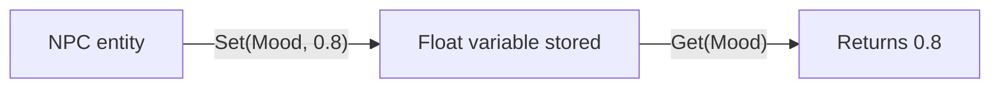

# CkVariables

Generic key-value variable storage on ECS entities. Template-based with typed specializations for Bool, Int32, Float, Vector, String, GameplayTag, Material, UObject, Entity, and more.

## Key Concepts

- **Variable Fragment** — Template `TFragment_Variables<T>` storing a `TMap<FName, T>`. Each type gets its own fragment specialization.
- **Dual Key Support** — Variables can be accessed by `FName` or `FGameplayTag`.
- **No Requests/Signals** — Variables are read and written directly. No deferred processing.

## Example: Storing NPC Mood



## Usage Examples

### Set a float variable

```cpp
TUtils_Variables<FFragment_Variable_Float>::Set(Entity, FName("Mood"), 0.8f);
```

### Get a variable

```cpp
float Mood = TUtils_Variables<FFragment_Variable_Float>::Get(Entity, FName("Mood"));
```

### Check if variable exists

```cpp
bool Has = TUtils_Variables<FFragment_Variable_Float>::Has(Entity, FName("Mood"));
```

## Tests

No tests found for this module in CkTest.
