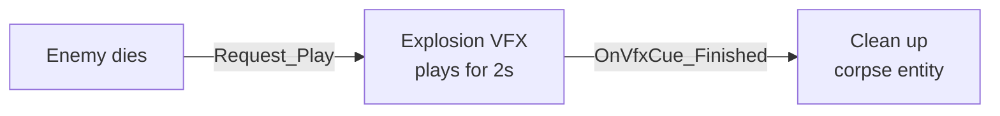

# CkVfx

Niagara VFX playback through ECS with lifecycle management, user parameters, and completion signals.

## Key Concepts

- **VfxCue** — An ECS entity wrapping a Niagara particle system. Configured via EntityScript and params.
- **Play/Stop** — Request-based control. Processor handles component creation, playback, and cleanup.
- **User Parameters** — Pass typed values (float, vector, color, bool, int) to the Niagara system at runtime.
- **Signals** — `OnVfxCue_Started` and `OnVfxCue_Finished` for lifecycle hooks.
- **Effect Duration** — Tracked per-cue. Processor monitors completion and fires finished signal.

## Example: Death Explosion Effect



## Usage Examples

### Add a VFX cue to an entity

```cpp
UCk_Utils_VfxCue_UE::Add(Entity, VfxCueEntityScript, CueParams);
```

### Play the effect

```cpp
UCk_Utils_VfxCue_UE::Request_Play(VfxCueHandle);
```

### Stop the effect

```cpp
UCk_Utils_VfxCue_UE::Request_Stop(VfxCueHandle);
```

### Listen for completion

```cpp
UCk_Utils_VfxCue_UE::BindTo_OnFinished(VfxCueHandle, OnFinishedDelegate);
```

## Tests

No tests found for this module in CkTest.
